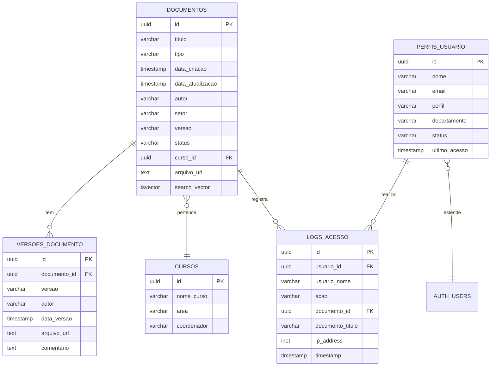

# Arquitetura do Sistema PROG

## 📐 Visão Geral da Arquitetura

O Sistema PROG segue uma arquitetura moderna de aplicação web, separando claramente as responsabilidades entre frontend e backend (preparado para integração).

```
┌─────────────────────────────────────────────────────────────┐
│                         USUÁRIO                              │
└─────────────────────────────────────────────────────────────┘
                            │
                            ▼
┌─────────────────────────────────────────────────────────────┐
│                    FRONTEND (React)                          │
│  ┌────────────┬────────────┬────────────┬────────────┐     │
│  │  Document  │    PPC     │   Search   │   Access   │     │
│  │ Management │ Management │  Assistant │  Control   │     │
│  └────────────┴────────────┴────────────┴────────────┘     │
│                                                              │
│  ┌──────────────────────────────────────────────────┐      │
│  │          ShadCN UI Components                     │      │
│  └──────────────────────────────────────────────────┘      │
└─────────────────────────────────────────────────────────────┘
                            │
                            ▼
┌─────────────────────────────────────────────────────────────┐
│                  BACKEND (Supabase)                          │
│  ┌────────────┬────────────┬────────────┬────────────┐     │
│  │ PostgreSQL │   Storage  │    Auth    │   Edge     │     │
│  │  Database  │   (Files)  │   (JWT)    │ Functions  │     │
│  └────────────┴────────────┴────────────┴────────────┘     │
│                                                              │
│  ┌──────────────────────────────────────────────────┐      │
│  │    Row Level Security (RLS) Policies              │      │
│  └──────────────────────────────────────────────────┘      │
└─────────────────────────────────────────────────────────────┘
                            │
                            ▼
┌─────────────────────────────────────────────────────────────┐
│              SERVIÇOS EXTERNOS (Futuro)                      │
│  ┌────────────┬────────────┬────────────┬────────────┐     │
│  │  LDAP/AD   │    Email   │    OCR     │   Backup   │     │
│  │   (Auth)   │  Service   │  Service   │  Storage   │     │
│  └────────────┴────────────┴────────────┴────────────┘     │
└─────────────────────────────────────────────────────────────┘
```

## 🎨 Padrões de Arquitetura Frontend

### 1. Component-Based Architecture

```
App.tsx (Main Container)
├── Header
│   ├── UserProfile
│   └── Notifications
├── Sidebar
│   └── NavigationMenu
└── MainContent
    ├── DocumentList
    ├── DocumentUpload
    ├── PPCManagement
    ├── SearchPanel
    │   ├── TraditionalSearch
    │   └── AISearchAssistant
    └── AccessControl
```

### 2. State Management

**Abordagem Atual**: Local State (useState)
```typescript
// Estado local em cada componente
const [documents, setDocuments] = useState([]);
const [filters, setFilters] = useState({});
```

**Recomendado para Produção**: 
- **Zustand** ou **Context API** para estado global
- **TanStack Query** para cache de dados do servidor

```typescript
// Exemplo com Zustand
import create from 'zustand';

interface DocumentStore {
  documents: Document[];
  filters: Filters;
  setDocuments: (docs: Document[]) => void;
  setFilters: (filters: Filters) => void;
}

const useDocumentStore = create<DocumentStore>((set) => ({
  documents: [],
  filters: {},
  setDocuments: (documents) => set({ documents }),
  setFilters: (filters) => set({ filters }),
}));
```

### 3. Data Flow

```
User Action
    │
    ▼
Component Event Handler
    │
    ▼
State Update (useState/Zustand)
    │
    ▼
Component Re-render
    │
    ▼
UI Update
```

**Com Backend (Futuro)**:
```
User Action
    │
    ▼
Component Event Handler
    │
    ▼
API Call (Supabase Client)
    │
    ▼
Backend Processing
    │
    ▼
Response
    │
    ▼
State Update
    │
    ▼
Component Re-render
```

## 🗄️ Arquitetura de Dados

### Schema do Banco de Dados

#### Entidades Principais



### Índices Recomendados

```sql
-- Busca textual
CREATE INDEX idx_documentos_search ON documentos USING gin(search_vector);

-- Filtros comuns
CREATE INDEX idx_documentos_tipo ON documentos(tipo);
CREATE INDEX idx_documentos_status ON documentos(status);
CREATE INDEX idx_documentos_setor ON documentos(setor);
CREATE INDEX idx_documentos_data ON documentos(data_atualizacao DESC);

-- Relações
CREATE INDEX idx_documentos_curso ON documentos(curso_id);
CREATE INDEX idx_versoes_documento ON versoes_documento(documento_id);
CREATE INDEX idx_logs_usuario ON logs_acesso(usuario_id);
CREATE INDEX idx_logs_documento ON logs_acesso(documento_id);
```

## 🔐 Arquitetura de Segurança

### Camadas de Segurança

```
┌──────────────────────────────────────────────┐
│  1. Frontend Validation                      │
│     - Input sanitization                     │
│     - Client-side permission checks          │
└──────────────────────────────────────────────┘
                  │
                  ▼
┌──────────────────────────────────────────────┐
│  2. API Authentication (Supabase)            │
│     - JWT token validation                   │
│     - Session management                     │
└──────────────────────────────────────────────┘
                  │
                  ▼
┌──────────────────────────────────────────────┐
│  3. Row Level Security (RLS)                 │
│     - Database-level permissions             │
│     - Per-row access control                 │
└──────────────────────────────────────────────┘
                  │
                  ▼
┌──────────────────────────────────────────────┐
│  4. Audit Logging                            │
│     - All actions logged                     │
│     - Immutable audit trail                  │
└──────────────────────────────────────────────┘
```

### Row Level Security Policies

```sql
-- Documentos: Consultor pode apenas ler
CREATE POLICY "consultor_read_documents" ON documentos
    FOR SELECT
    USING (
        EXISTS (
            SELECT 1 FROM perfis_usuario
            WHERE id = auth.uid()
            AND perfil = 'Consultor'
        )
    );

-- Documentos: Editor pode ler e editar do seu setor
CREATE POLICY "editor_manage_documents" ON documentos
    FOR ALL
    USING (
        EXISTS (
            SELECT 1 FROM perfis_usuario
            WHERE id = auth.uid()
            AND perfil IN ('Editor', 'Administrador')
            AND (perfil = 'Administrador' OR departamento = documentos.setor)
        )
    );

-- Logs: Apenas leitura para Administradores
CREATE POLICY "admin_read_logs" ON logs_acesso
    FOR SELECT
    USING (
        EXISTS (
            SELECT 1 FROM perfis_usuario
            WHERE id = auth.uid()
            AND perfil = 'Administrador'
        )
    );
```

## 🔍 Arquitetura de Busca

### Sistema de Busca em Camadas

```
┌─────────────────────────────────────────────────────────┐
│                    Camada de UI                          │
│  - SearchPanel (tradicional)                             │
│  - AISearchAssistant (inteligente)                       │
└─────────────────────────────────────────────────────────┘
                        │
                        ▼
┌─────────────────────────────────────────────────────────┐
│              Camada de Processamento                     │
│  - Natural Language Processing                           │
│  - Entity extraction                                     │
│  - Query builder                                         │
└─────────────────────────────────────────────────────────┘
                        │
                        ▼
┌─────────────────────────────────────────────────────────┐
│                Camada de Dados                           │
│  - Full-text search (PostgreSQL tsvector)                │
│  - Filtered queries                                      │
│  - Ranking and relevance                                 │
└─────────────────────────────────────────────────────────┘
```

### Processamento de Consultas IA

```typescript
interface QueryAnalysis {
  interpretation: string;      // Interpretação humana
  entities: {                   // Entidades extraídas
    courses?: string[];
    documentTypes?: string[];
    dateRange?: string;
    sectors?: string[];
    status?: string[];
    keywords?: string[];
  };
  filters: Filter[];            // Filtros a aplicar
  sqlQuery: string;             // SQL gerado
  results: Document[];          // Resultados
}
```

### Full-Text Search Implementation

```sql
-- Criar coluna de busca
ALTER TABLE documentos ADD COLUMN search_vector tsvector;

-- Trigger para atualização automática
CREATE FUNCTION documentos_search_update() RETURNS trigger AS $$
BEGIN
  NEW.search_vector :=
    setweight(to_tsvector('portuguese', coalesce(NEW.titulo, '')), 'A') ||
    setweight(to_tsvector('portuguese', coalesce(NEW.descricao, '')), 'B') ||
    setweight(to_tsvector('portuguese', coalesce(NEW.autor, '')), 'C') ||
    setweight(to_tsvector('portuguese', coalesce(NEW.setor, '')), 'D');
  RETURN NEW;
END;
$$ LANGUAGE plpgsql;

CREATE TRIGGER documentos_search_trigger
  BEFORE INSERT OR UPDATE ON documentos
  FOR EACH ROW EXECUTE FUNCTION documentos_search_update();

-- Busca com ranking
SELECT
  *,
  ts_rank(search_vector, plainto_tsquery('portuguese', $1)) AS rank
FROM documentos
WHERE search_vector @@ plainto_tsquery('portuguese', $1)
ORDER BY rank DESC;
```

## 📁 Arquitetura de Armazenamento

### Storage Buckets (Supabase)

```
/storage
├── /documents              # Documentos principais
│   ├── /ppcs              # PPCs
│   │   └── /[curso_id]
│   ├── /resolucoes        # Resoluções
│   ├── /relatorios        # Relatórios
│   └── /atas              # Atas
├── /versions              # Versões antigas
│   └── /[document_id]
└── /temp                  # Upload temporário
```

### Storage Policies

```sql
-- Leitura: Todos os autenticados
CREATE POLICY "authenticated_read" ON storage.objects
    FOR SELECT
    USING (auth.role() = 'authenticated');

-- Upload: Editor e Administrador
CREATE POLICY "editor_upload" ON storage.objects
    FOR INSERT
    WITH CHECK (
        auth.role() = 'authenticated' AND
        EXISTS (
            SELECT 1 FROM perfis_usuario
            WHERE id = auth.uid()
            AND perfil IN ('Editor', 'Administrador')
        )
    );

-- Delete: Apenas Administrador
CREATE POLICY "admin_delete" ON storage.objects
    FOR DELETE
    USING (
        EXISTS (
            SELECT 1 FROM perfis_usuario
            WHERE id = auth.uid()
            AND perfil = 'Administrador'
        )
    );
```

## 🔄 Versionamento de Documentos

### Estratégia de Versionamento

```
Documento v1.0
    │
    ├─── Edição menor ──> v1.1
    │         │
    │         └─── Bug fix ──> v1.1.1
    │
    └─── Edição major ──> v2.0
              │
              └─── Edição menor ──> v2.1
```

### Fluxo de Versionamento

```typescript
// 1. Usuário faz upload de novo arquivo
async function uploadNewVersion(documentId: string, file: File) {
  // 2. Sistema detecta documento existente
  const existingDoc = await getDocument(documentId);
  
  // 3. Incrementa versão
  const newVersion = incrementVersion(existingDoc.versao);
  
  // 4. Salva versão anterior
  await createVersion({
    documento_id: documentId,
    versao: existingDoc.versao,
    arquivo_url: existingDoc.arquivo_url,
    autor: existingDoc.autor,
    data_versao: existingDoc.data_atualizacao
  });
  
  // 5. Atualiza documento principal
  await updateDocument(documentId, {
    versao: newVersion,
    arquivo_url: newFileUrl,
    data_atualizacao: new Date()
  });
  
  // 6. Registra no log
  await createLog({
    acao: 'Upload Nova Versão',
    documento_id: documentId,
    versao: newVersion
  });
}
```

## 📊 Arquitetura de Analytics

### Métricas Coletadas

```typescript
interface Analytics {
  // Uso do sistema
  daily_active_users: number;
  documents_uploaded: number;
  searches_performed: number;
  
  // Performance
  avg_search_time: number;
  avg_upload_time: number;
  
  // Popular
  most_viewed_documents: Document[];
  most_searched_terms: string[];
  
  // Por setor
  uploads_by_sector: Record<string, number>;
  downloads_by_sector: Record<string, number>;
}
```

### Eventos Rastreados

```typescript
// Event tracking
trackEvent('document_viewed', {
  document_id: string,
  document_type: string,
  user_role: string,
  timestamp: Date
});

trackEvent('search_performed', {
  query: string,
  search_type: 'traditional' | 'ai',
  results_count: number,
  timestamp: Date
});

trackEvent('document_uploaded', {
  document_type: string,
  file_size: number,
  sector: string,
  timestamp: Date
});
```

## 🚀 Arquitetura de Deploy

### Ambiente de Desenvolvimento

```
Developer Machine
    │
    ├── npm run dev (Vite)
    ├── Hot Module Reload
    └── Local Supabase (Docker)
```

### Ambiente de Produção

```
┌─────────────────────────────────────────────┐
│              CDN (Cloudflare)                │
│  - Static assets                             │
│  - Edge caching                              │
└─────────────────────────────────────────────┘
                  │
                  ▼
┌─────────────────────────────────────────────┐
│         Hosting (Vercel/Netlify)             │
│  - React application                         │
│  - SSR (if needed)                           │
│  - Environment variables                     │
└─────────────────────────────────────────────┘
                  │
                  ▼
┌─────────────────────────────────────────────┐
│           Supabase Cloud                     │
│  - PostgreSQL database                       │
│  - File storage                              │
│  - Authentication                            │
│  - Real-time subscriptions                   │
└─────────────────────────────────────────────┘
```

### CI/CD Pipeline

```yaml
# GitHub Actions workflow
name: Deploy Production

on:
  push:
    branches: [main]

jobs:
  test:
    - Run unit tests
    - Run integration tests
    - Run E2E tests
    - Check code coverage

  build:
    - Build React app
    - Optimize assets
    - Generate source maps

  deploy:
    - Deploy to Vercel
    - Run database migrations
    - Invalidate CDN cache
    - Notify team
```

## 🔧 Decisões de Arquitetura (ADRs)

### ADR-001: React como Framework Frontend
**Decisão**: Usar React 18 com TypeScript  
**Razão**: Ecossistema maduro, performance, tipo-segurança  
**Consequências**: Curva de aprendizado, bundle size

### ADR-002: Supabase como Backend
**Decisão**: Usar Supabase em vez de backend custom  
**Razão**: Desenvolvimento rápido, features built-in, escalabilidade  
**Consequências**: Lock-in do vendor, limitações em queries complexas

### ADR-003: ShadCN/UI para Componentes
**Decisão**: Usar ShadCN em vez de library como MUI  
**Razão**: Customização total, sem runtime overhead, acessibilidade  
**Consequências**: Mais trabalho inicial, manutenção de componentes

### ADR-004: Client-Side Rendering
**Decisão**: CSR em vez de SSR  
**Razão**: Aplicação interna, não precisa SEO, interatividade  
**Consequências**: Tempo inicial de carregamento maior

## 📈 Escalabilidade

### Estratégias de Escalabilidade

#### Horizontal Scaling
- Supabase gerencia automaticamente
- Connection pooling
- Read replicas para queries pesadas

#### Vertical Scaling
- Upgrade de plano Supabase conforme necessário
- Otimização de queries

#### Caching
```typescript
// React Query para cache de dados
const { data } = useQuery(
  ['documents', filters],
  () => fetchDocuments(filters),
  {
    staleTime: 5 * 60 * 1000, // 5 minutos
    cacheTime: 10 * 60 * 1000, // 10 minutos
  }
);
```

#### Performance Budgets
- First Contentful Paint: < 1.5s
- Time to Interactive: < 3.5s
- Lighthouse Score: > 90

---

**Versão**: 1.0.0  
**Última Revisão**: Março 2024
